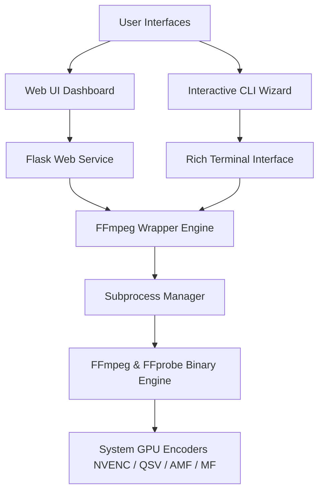

# Obsidian Codec

Obsidian Codec is a high-performance, cross-platform media processing suite that wraps the capabilities of FFmpeg into two accessible interfaces: a terminal-based interactive command-line wizard and a local, glassmorphic Web UI. It is designed to simplify complex video, audio, subtitle, and metadata operations while maximizing system throughput via automated hardware-accelerated transcoding pipelines.

---

## Key Features

- **Multi-Interface Control:** Toggle between a rich terminal CLI (`cli.py` powered by `rich`) and a local Web dashboard (`webui.py` powered by `Flask`).
- **Automated GPU Acceleration:** Real-time system controller probes for physical graphics hardware and dynamically maps standard software encoders (`libx264`, `libx265`) to corresponding hardware-accelerated codecs (Nvidia `NVENC`, Intel `QSV`, AMD `AMF`, and Windows `Media Foundation`).
- **Interactive Stream Analysis:** Visual mappings of wrapper formats, container bitrates, video tracks, audio layouts, subtitle streams, and embedded chapters via `ffprobe`.
- **Advanced Demuxing & Muxing:** 
  - Standalone audio extraction (MP3, AAC, FLAC, WAV, Opus).
  - Video stream isolation (muting).
  - Subtitle track extraction (SRT, WebVTT).
  - Subtitle and audio track injection (supporting both soft-muxing and hard burn-in).
  - Automatic subtitle formatting safeguards for MP4/MOV container compatibility (`mov_text`).
- **Contact Sheet & Animation Generation:**
  - Automated thumbnail contact sheet generation with dynamic time-spaced selectors.
  - Frame extraction at exact seek points or sequential intervals.
  - High-fidelity looping GIFs with Lanczos scaling and custom palette generation.
- **Job & Subprocess Management:** Real-time log capture, task execution tracking, status reporting, and full parent-child process tree termination utilizing `psutil`.

---

## Architecture



---

## Prerequisites

- **Python:** Version 3.7 or higher.
- **FFmpeg & FFprobe:** Installed and configured in the system environment variables (`PATH`). 
  - *Note:* The application relies on system-level FFmpeg binaries. Check path availability by running `ffmpeg -version` and `ffprobe -version` in your shell.

---

## Installation & Environment Setup

### Method A: Automated Setup (Windows)

Double-click the `setup.bat` script in the root directory. The script automates:
1. Verification of local Python and FFmpeg installations.
2. Creation of a isolated Python virtual environment (`venv`).
3. Core `pip` upgrade.
4. Installation of project dependencies listed in `requirements.txt`.

### Method B: Manual Setup (Cross-Platform / Linux / macOS)

For UNIX environments or manual installation, execute the following commands in the project root:

1. **Create a virtual environment:**
   ```bash
   python -m venv venv
   ```

2. **Activate the virtual environment:**
   - **Windows (Command Prompt):**
     ```cmd
     call venv\Scripts\activate.bat
     ```
   - **Windows (PowerShell):**
     ```powershell
     .\venv\Scripts\Activate.ps1
     ```
   - **macOS / Linux (Bash/Zsh):**
     ```bash
     source venv/bin/activate
     ```

3. **Install dependencies:**
   ```bash
   pip install --upgrade pip
   pip install -r requirements.txt
   ```

---

## Usage Instructions

### 1. Launching the Web UI
The Web UI provides a responsive, dark-themed dashboard.

- **Windows:** Double-click `webui.bat` or run:
  ```cmd
  python obsidian_codec/src/web_ui/webui.py
  ```
- **macOS / Linux:**
  ```bash
  python obsidian_codec/src/web_ui/webui.py
  ```
Open your web browser and navigate to `http://127.0.0.1:5000`.

### 2. Launching the CLI Interactive Wizard
The interactive terminal guides you through media source selection, metadata inspection, operations configurations, and processing pipelines.

- **Windows:** Double-click `CLI.bat` or run:
  ```cmd
  python obsidian_codec/src/cmd_line/cli.py -interactive
  ```
- **macOS / Linux:**
  ```bash
  python obsidian_codec/src/cmd_line/cli.py --interactive
  ```

### 3. CLI Programmatic Flags
You can skip the interactive wizard by specifying parameters directly:

- **Metadata Probing:**
  ```bash
  python obsidian_codec/src/cmd_line/cli.py -i input.mp4 --probe
  ```
- **Standard Transcode / Compress:**
  ```bash
  python obsidian_codec/src/cmd_line/cli.py -i input.mkv -o output.mp4 -c:v libx264 --crf 23 --preset medium -c:a aac
  ```
- **Audio Extraction:**
  ```bash
  python obsidian_codec/src/cmd_line/cli.py -i input.mp4 -o audio.mp3 --extract-audio -c:a libmp3lame
  ```
- **Mute Video Extraction:**
  ```bash
  python obsidian_codec/src/cmd_line/cli.py -i input.mp4 -o muted.mp4 --extract-video -c:v copy
  ```
- **Subtitle Demuxing:**
  ```bash
  python obsidian_codec/src/cmd_line/cli.py -i input.mkv -o subs.srt --extract-subs --sub-track 0
  ```

---

## Licensing & Asset Restrictions

This project is licensed under the terms of the **MIT License**, with the exception of the brand identity and UI design assets.

### Proprietary Assets Exclusion
The MIT License **does not** cover the following graphical assets:
- `obsidian_codec/src/web_ui/assets/cheap_logo.png`
- `obsidian_codec/src/web_ui/assets/loading_animation/last_layer.png`
- `obsidian_codec/src/web_ui/assets/loading_animation/middle_layer.png`
- `obsidian_codec/src/web_ui/assets/loading_animation/top_layer.png`

These files are the proprietary property of the creator. All rights are reserved for these assets. You may not reuse, redistribute, modify, or sublicense them without express written permission from the copyright holder.
